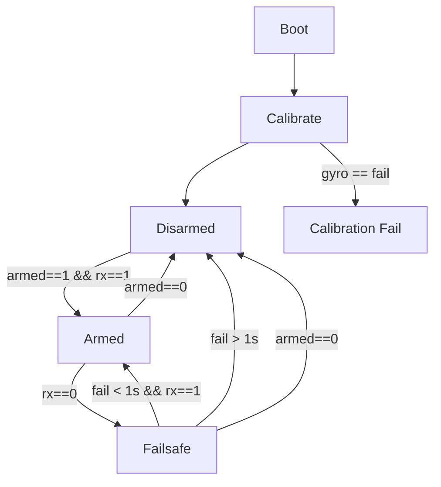

### Flight Controller States

```mermaid
graph TD
  boot[Boot]
  cal[Calibrate]
  cal_fail[Calibration Fail]
  
  armed[Armed]
  fail[Failsafe]
  disarmed[Disarmed]


  boot --> cal --> disarmed
  cal --> |gyro == fail |cal_fail

  disarmed --> |armed==1 && rx==1| armed 
  
  fail --> |fail > 1s | disarmed
  fail --> | armed==0 | disarmed
  fail --> |fail < 1s && rx==1| armed
  
  armed --> | armed==0|disarmed
  armed --> |rx==0|fail
  
```